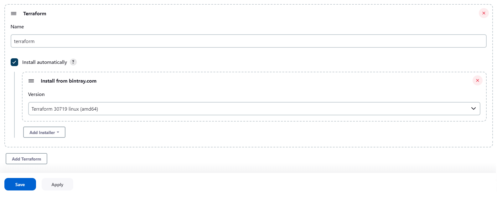

## Utilizing Jenkins for Kubernetes Deployment


### Prerequisites:

- Ensure that Docker engine is installed on your local machine.
- Ensure that Minikube is installed on your local machine.

### Installation

If you are using WSL on Windows, please follow these instructions to configure WSL with the appropriate resources:

1. Create or apply the file `C:\Users\{username}\.wslconfig`. The content should be:

```
[wsl2]
memory=20GB
processors=6
```

2. After setting the WSL configuration, restart WSL by running the following command in PowerShell with admin privileges:

```powershell
wsl --shutdown
wsl
```

This will ensure that the memory and processors are set correctly.

3. Start the Kubernetes service by running the following commands:

```bash
minikube start --memory=16384 --cpus=4 --nodes 2 --network-plugin=cni --cni=calico --kubernetes-version=v1.26.1 --driver=docker
```

4. Use Tunnel to allow gateway:

```bash
minikube tunnel
```

Keep the terminal running, as this process must stay alive for the tunnel to be accessible.

5. Open a new terminal, clone this repository to your local machine, and execute the following command:

```bash
which docker
```

If the output is **different** from `/usr/bin/docker`, make changes to the volume host path in [docker-compose.yml](./docker-compose.yml) under the Jenkins service section:

```yaml
---
volumes:
  - ./jenkins/home:/var/jenkins_home
  - <output of which docker>:/usr/bin/docker
  - /var/run/docker.sock:/var/run/docker.sock
```

6. Start the service by running:

```bash
docker compose up -d
```

7. Next, navigate to http://localhost:8080. The Jenkins unlock page should appear.

  

8. Execute the command:

```bash
docker exec jenkins cat /var/jenkins_home/secrets/initialAdminPassword
```

Copy the admin password and paste it into the web interface. Proceed by selecting **"Install suggested plugins"** and wait for the installation to complete. Then, create an admin user.

### Plugin Installation

To install plugins in Jenkins, go to **"Manage Jenkins > Plugins > Available plugins"**. In the search box, enter the name of your desired plugins. For our case, select the following plugins:

- [Docker Pipeline](https://plugins.jenkins.io/docker-workflow)
- [Terraform](https://plugins.jenkins.io/terraform/)
- [Kubernetes CLI](https://plugins.jenkins.io/kubernetes-cli)

and install them.

### Adding Dockerhub Credentials to Jenkins

To add Dockerhub credentials, navigate to **"Manage Jenkins > Manage Credentials > Global > Add Credentials"**. Enter your DockerHub user credentials and provide an ID, for example, **`dockerHubLogin`**.

### Adding Minikube Secret Configuration to Jenkins

First, create the config file by navigating to the original config file. The default location is `~/.kube/config`, or in Windows (WSL path) `/mnt/c/Users/{username}/.kube/config`. Confirm this file exists; if not, it means your running Minikube has some issues.

Then we need to create a standalone config file. To do that, run the following commands:

```bash
sudo chmod +x ./standalone_kubeconfig_file.sh
sudo ./standalone_kubeconfig_file.sh /path/to/config
```

This script will create the config file for you.

Now all that's left is to upload the config file into the Jenkins credentials. Navigate to **"Manage Jenkins > Credentials > Global > Add Credentials"**. In the kind field, choose "Secret file," then drag the config file that you created and set the ID to `"kubeConfig"`.

### Set Terraform Tool

In **"Manage Jenkins > Tools"**, scroll down until you see the title "Terraform." Click on **"Add Terraform"**, name it `Terraform`, and choose the latest Linux version (amd64). Then choose **"Add Installer"** and select **"Install from bintray.com"**:


### Creating a Pipeline

Before creating the pipeline, ensure you have a Jenkinsfile. This file should be located within your source code management (SCM) project repository. The Jenkinsfile should follow a structure similar to the example below in Groovy syntax:

```groovy
pipeline {
  triggers {
    pollSCM '* * * * *' // every 1 min
  }
  tools {
    terraform 'Terraform'
  }
  environment {
    dockerimagename = "<username>/<imagename>:latest"
    dockerImage = ""
  }

  agent any

  stages {
    stage('Build image') {
      steps {
        script {
          dockerImage = docker.build(dockerimagename)
        }
      }
    }
    stage('Pushing Image') {
      steps {
        withDockerRegistry([credentialsId: 'dockerHubLogin', url: '']) {
          script {
            dockerImage.push("latest")
          }
        }
      }
    }

    stage('Apply Kubernetes') {
      steps {
        withKubeConfig([credentialsId: 'kubeConfig']) {
          script {
            sh '''
            export KUBE_CONFIG_PATH=$KUBECONFIG
            cd ./terraform 
            terraform init -upgrade
            terraform apply -auto-approve
            '''
          }
        }
      }
    }
  }
}
```

The Jenkinsfile defines a pipeline with three stages:

1. "Build image" stage: This stage builds a Docker image using the specified `dockerimagename`.

2. "Pushing Image" stage: This stage pushes the Docker image to a Docker registry. It uses the DockerHub credentials specified in the `dockerHubLogin` variable and pushes the image with the "latest" tag.

3. "Apply Kubernetes" stage: This stage applies the changes into the Kubernetes cluster using the kubeConfig configuration.

The pipeline is set to trigger every minute (`pollSCM '* * * * *'`). It runs on any available agent and executes the defined stages sequentially.

You can use the provided repository [https://github.com/reuvengil/ci-cd-app-demo](https://github.com/reuvengil/ci-cd-app-demo) for testing purposes. Simply replace it with the URL of your own repository. If your repository is private, remember to create credentials for it using the **"Manage Credentials"** option, just like we did for DockerHub credentials. The given repository URL serves as a complete example of using a Jenkinsfile.

Once you have created the Git project containing the Jenkinsfile and Dockerfile, return to the Jenkins dashboard. Select **"New Item"** and create a Pipeline with the given instructions.

After setting up the pipeline, it will trigger automatically every minute due to the `pollSCM` trigger, or you can manually trigger it to test the running Kubernetes cluster.


To test the Kubernetes cluster, run the following command:
```powershell
curl --location 'http://localhost/' \
--header 'Host: app.devopsbyexample.com'
```

This guide covers the deployment of a Kubernetes cluster using Jenkins, including Docker, Minikube, and Terraform integration. It also shows how to set up plugins, credentials, and a Jenkins pipeline for automated deployment. Feel free to use the provided resources as a starting point for your own projects. Happy coding!