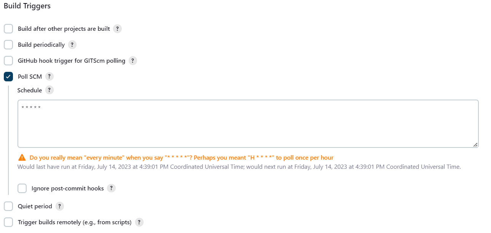

## Utilizing Jenkins for Kubernetes Deployment

### Prerequisites:

- Ensure that Docker engine is installed on your local machine.

### Installation

To begin, clone this repository to your local machine, and execute the following command:

```
which docker
```

If the output is **different** from `/usr/bin/docker`, make changes to the volume host path in [docker-compose.yml](./docker-compose.yml) under the Jenkins service section:

```yml
---
volumes:
  - ./jenkins/home:/var/jenkins_home
  - <output of which docker>:/usr/bin/docker
  - /var/run/docker.sock:/var/run/docker.sock
```

Start the service by running:

```
docker compose up -d
```

Next, navigate to http://localhost:8080. The page should appear as shown below:


Execute the command:

```
docker exec jenkins cat /var/jenkins_home/secrets/initialAdminPassword
```

Copy the admin password and paste it into the web interface. Proceed by selecting **"install suggested plugins"** and wait for the installation to complete. Then, create an admin user.

### Plugin Installation

To install plugins in Jenkins, go to **"Manage Jenkins > Plugins > Available plugins"**. In the search box, enter the name of your desired plugin, such as "Docker Pipeline," and install it.

### Adding Dockerhub Credentials to Jenkins

To add Dockerhub credentials, navigate to **"Manage Jenkins > Manage Credentials > Global > Add Credentials"**. Enter your DockerHub user credentials and provide an ID, for example, **"dockerHubLogin"**.

### Creating a Pipeline

Before creating the pipeline, ensure you have a Jenkinsfile. This file should be located **within your source code management (SCM) project repository**. The Jenkinsfile should follow a structure similar to the example below in Groovy syntax:

```groovy
pipeline {
  triggers {
    pollSCM '* * * * *' // every 1 minute
  }
  environment {
    dockerimagename = "<dockerHubUserName>/<imageName>:tag"
    dockerImage = ""
  }

  agent any

  stages {
    stage('Build image') {
      steps {
        script {
          dockerImage = docker.build(dockerimagename)
        }
      }
    }

    stage('Pushing Image') {
      steps {
        withDockerRegistry([credentialsId: 'dockerHubLogin', url: '']) {
          script {
            dockerImage.push("latest")
          }
        }
      }
    }
  }
}
```

The Jenkinsfile defines a pipeline with two stages:

1. "Build image" stage: This stage builds a Docker image using the specified `dockerimagename`.

2. "Pushing Image" stage: This stage pushes the Docker image to a Docker registry. It uses the DockerHub credentials specified in the `dockerHubLogin` variable and pushes the image with the "latest" tag.

The pipeline is set to trigger every minute (`pollSCM '* * * * *'`). It runs on any available agent and executes the defined stages sequentially.

Once you have created the Git project containing the Jenkinsfile and Dockerfile, return to the Jenkins dashboard. Select **"New Item"** and create a Pipeline with the following instructions:




Replace the Repository URL with the URL of your repository. If your repository is private, you will need to create credentials for it using **"Manage Credentials"**, similar to how we did for DockerHub credentials.

then hit save.
That it:)
